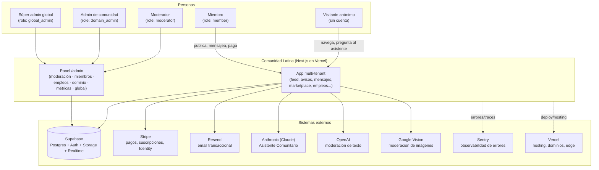
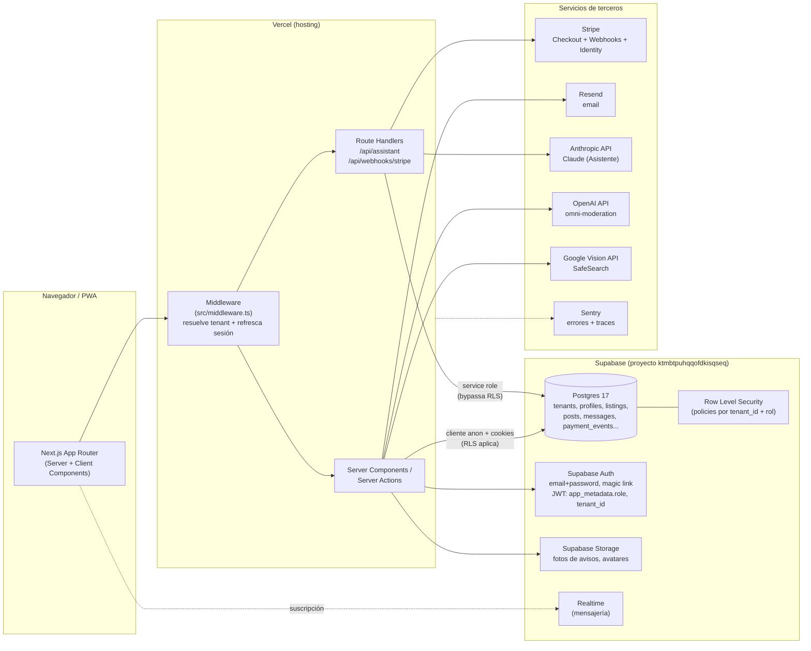
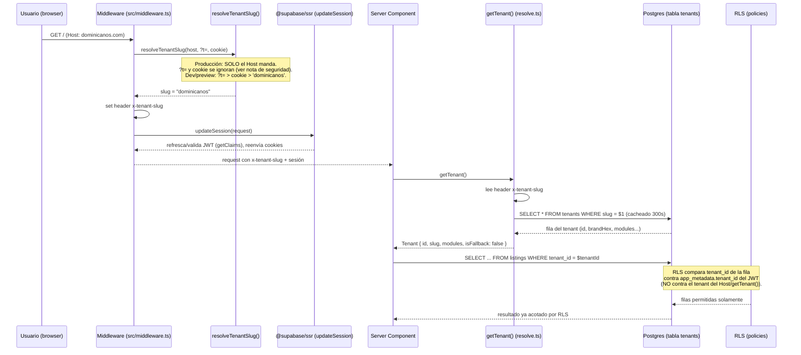
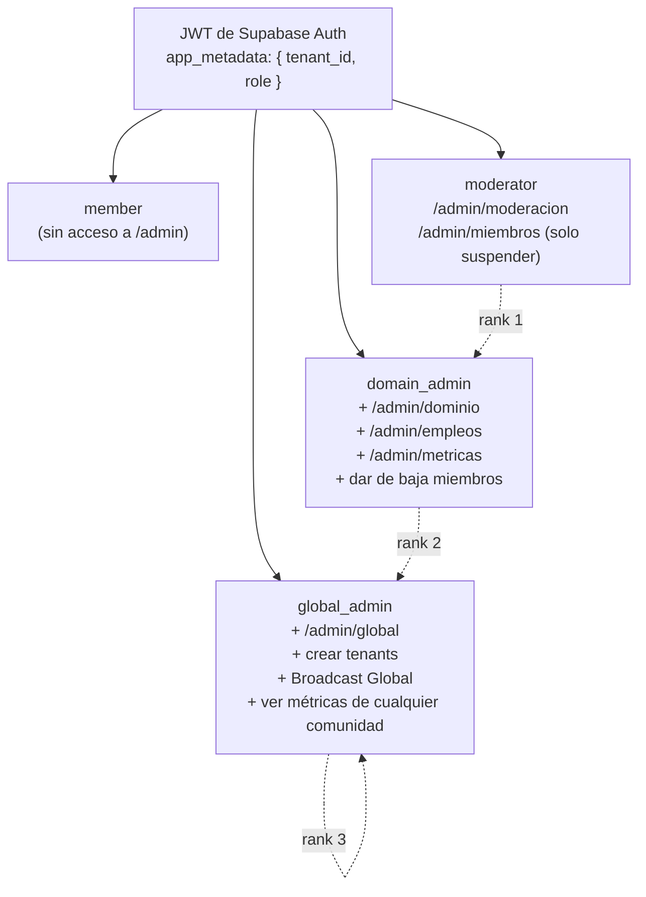

# Arquitectura de Comunidad Latina

Este documento es la referencia técnica de arquitectura para el equipo de mantenimiento. Tres vistas: contexto (quién usa qué), contenedores (qué sistema hace qué) y el flujo de resolución de tenant en un request — que es donde vive la frontera de seguridad real del producto.

> Fuente de verdad del código: `src/middleware.ts`, `src/lib/tenant/resolve.ts`, `src/app/admin/guard.ts`, `supabase/migrations/`. Donde este documento y `docs/ARQUITECTURA.md` (el contrato del enjambre) difieren del código actual, se señala explícitamente — ver "Discrepancias" al final.

---

## 1. Vista de contexto

Quiénes usan la plataforma y con qué sistemas externos interactúa.

**Lectura:** no hay un "portal de administración" separado — `/admin` es parte de la misma aplicación Next.js, protegida por rol en el servidor. El visitante anónimo sí toca el sistema de IA (Asistente Comunitario) sin cuenta, con límites de uso propios (ver §3 de `apis.md`).

---

## 2. Vista de contenedores

**Notas de esta vista:**

- **Dos caminos de acceso a Postgres**, y son la línea que separa lo seguro de lo peligroso: el camino normal (Server Components / Server Actions, `lib/supabase/server.ts`) usa la clave `anon` + las cookies de sesión del usuario → **RLS se aplica siempre**. El camino de `service_role` (`lib/supabase/admin.ts`, marcado `server-only`) bypassa RLS por completo y está reservado, por contrato del código, a: webhooks de Stripe, jobs internos, moderación server-side y el registro de auditoría append-only. Nunca se usa para responder una lectura de un usuario en su propio request.
- **El Asistente Comunitario usa Anthropic (Claude), no OpenAI** — el retrieval de contexto es full-text search nativo de Postgres (`match_chunks_fts`), no embeddings. OpenAI en este stack es exclusivamente para moderación de texto (`omni-moderation-latest`).
- **No hay contenedor de cron separado**: las purgas periódicas (mensajes vencidos, notificaciones, auditoría, eventos de pago procesados) corren como jobs `pg_cron` **dentro de Postgres** (`supabase/migrations/0013_cron_ttl.sql`), no como rutas de Next.js — ver "Discrepancias".

---

## 3. Flujo de resolución de tenant en un request

Este es el diagrama que importa para entender la seguridad multi-tenant de punta a punta.

### La frontera de seguridad real (leer esto antes de tocar una query)

Hay **dos nociones de "tenant" distintas** en cada request, y confundirlas es la forma más fácil de introducir una fuga cross-tenant:

1. **El tenant del Host** (`getTenant()`, arriba): decide qué *branding* se pinta — nombre, color, módulos activos. Se resuelve por dominio (o `?t=` fuera de producción) y **es información pública**, sin autenticación.
2. **El tenant del JWT** (`user.app_metadata.tenant_id`): decide qué *datos* puede leer o escribir un usuario autenticado. Lo fija el servidor en el signup (nunca lo elige el cliente) y es lo que las políticas de RLS comparan, fila por fila, en Postgres.

El filtro `.eq('tenant_id', tenant.id)` que ves en la mayoría de las queries (`src/app/admin/dominio/page.tsx`, por ejemplo) es **una comodidad de UX y de rendimiento** — evita traer de más y usa el tenant del Host para mostrar la comunidad correcta a un visitante anónimo. **No es la barrera de seguridad.** La barrera es RLS con el `tenant_id` del JWT, y sigue aplicando incluso si ese `.eq()` se olvidara en una pantalla nueva.

Por eso `src/lib/tenant/resolve.ts` expone `isFallback: true` en el tenant que devuelve cuando la base no responde o el slug no existe: ese flag existe específicamente para que el código nunca compare un tenant "de emergencia" (un `id` placeholder) contra el `tenant_id` real del JWT.

### Por qué `?t=` y la cookie se ignoran en producción

Esto fue una corrección de seguridad real, documentada en el propio código (`clientTenantHintsAllowed()`, `src/lib/tenant/resolve.ts`): el Asistente Comunitario atiende a visitantes **anónimos** y su búsqueda (RAG) corre con `service_role`, que bypassa RLS por completo — la única frontera ahí es el argumento `tenant_id` que se le pasa a la función. Si `?t=` gobernara el tenant en producción, cualquiera podría leer el contenido (`rag_chunks`) de otra comunidad con solo cambiar un parámetro de URL. La corrección: en producción, **solo el Host decide** — `?t=` y la cookie quedan vivos únicamente en desarrollo y tests.

**Trade-off documentado a propósito:** una comunidad sin dominio propio deja de ser alcanzable por `?t=` en producción — necesita su dominio en el mapa de resolución (ver `docs/entrega/crear-dominio-nuevo.md`).

---

## 4. Roles y sus fronteras

El rango es acumulativo (`ROLE_RANK` en `src/app/admin/guard.ts`): cada rol superior puede todo lo del anterior. La fuente de verdad del rol es **siempre el JWT**, nunca la columna `profiles.role` (que es informativa) — la misma regla rige tanto el gate del panel como las políticas de RLS, que leen el claim con `app.current_user_role()`.

---

## 5. Discrepancias entre este documento, `docs/ARQUITECTURA.md` y el código

Por instrucción explícita: donde el contrato interno (`docs/ARQUITECTURA.md`) y el código difieren, gana el código. Estas son las diferencias encontradas al auditar para esta entrega:

| Tema | Dice `docs/ARQUITECTURA.md` §3 | Hace el código hoy |
|---|---|---|
| Resolución Host→tenant | "el middleware lee Host → resuelve tenant vía RPC `get_tenant_by_domain` (con cache en memoria + fallback)" | `src/middleware.ts` llama a `resolveTenantSlug()`, una función **pura y síncrona** que resuelve contra un mapa fijo en código (`DOMAIN_TENANTS`, en `src/lib/tenant/resolve.ts`) — **no** llama a la RPC. La RPC `get_tenant_by_domain` existe en la base (migración `0014_rpcs.sql`) y la tabla `tenant_domains` también, pero hoy nada en el runtime del middleware los usa. Esto está en transición activa — ver `docs/entrega/crear-dominio-nuevo.md`, que documenta el camino por base de datos como el que corresponde una vez migrado. |
| Cron jobs | §2 y §9: "`api/cron/…/route.ts` (protegidos con `CRON_SECRET`)" | No existe ningún directorio `src/app/api/cron/` ni ruta protegida con `CRON_SECRET` en el código actual. Las tareas periódicas (purga de mensajes, notificaciones, auditoría, eventos de pago) son jobs `pg_cron` que corren **dentro de Postgres** (`supabase/migrations/0013_cron_ttl.sql`). `CRON_SECRET` sí existe como variable de entorno, pero hoy se usa para otra cosa: es la semilla del HMAC que firma la cookie de cortesía del Asistente anónimo y (si no hay `ASSISTANT_QUERY_SECRET` dedicado) el hash de las preguntas del Asistente — ver `docs/entrega/apis.md`. |
| Moderación de IA | Tabla del stack (§1): lista "OpenAI omni-moderation (activo) + Google Vision (degradado)" y no menciona ningún otro proveedor de IA | El Asistente Comunitario (`/api/assistant`) usa **Anthropic (Claude)**, con su propia variable `ANTHROPIC_API_KEY` y su propio flag `isAnthropicConfigured` — un proveedor de IA adicional, no mencionado en la tabla de stack del contrato. |

Ninguna de estas discrepancias es un problema de seguridad: la frontera real (RLS + JWT, §3 de este documento) no depende de cuál de los dos mecanismos de resolución de Host esté activo — ambos terminan inyectando el mismo `x-tenant-slug`, y ninguno de los dos participa en la autorización de datos autenticados.
